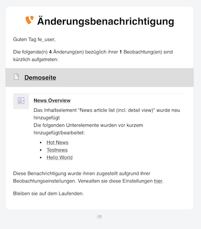

<div align="center">


# TYPO3 extension `xima_typo3_page_subscription`

[]()

</div>

This extension provides an update subscription functionality for frontend user regarding changes on content elements on a page.

> **Note:** This extension is still under development and not yet ready for production.

- [Principles](#principles)
    * [What does it do?](#what-does-it-do)
    * [What does it not do?](#what-does-it-not-do)
    * [Challenges](#challenges)
- [Requirements](#requirements)
- [Installation](#installation)
    * [Composer](#composer)
    * [Configuration](#configuration)
    * [Template](#template)
    * [Scheduler](#scheduler)
    * [Easy setup](#easy-setup)
- [Concept](#concept)
    * [JavaScript](#javascript)
    * [ViewHelper](#viewhelper)
    * [Interpreter](#interpreter)
    * [Console command](#console-command)
    * [Crawler](#crawler)
    * [Fingerprint](#fingerprint)
    * [Hash](#hash)
    * [Mailer](#mailer)
- [Thoughts](#thoughts)
- [ToDo](#todo)
- [Outlook](#outlook)
- [License](#license)

<a name="principles"></a>
## Principles

<a name="what-does-it-do"></a>
### What does it do?

- Subscribe as frontend user to a page
- Manage your subscriptions
- Get notified by mail about updates on subscribed pages
    - Informing about new or changed content elements
- Providing a console command for checking updates
- Providing a crawler for fetching content elements
- Support partly subscriptions for single content elements

<a name="what-does-it-not-do"></a>
### What does it not do?

- Providing detailed information about changed fields
- Informing about deleted content elements

<a name="challenges"></a>
### Challenges

- Keeping **dynamic elements** on a page in mind, e.g. all entries of a news teaser list, which are basically not referenced on the coressponding page
- Finding all content data which are **relevant for the frontend** (not every update is a relevant change for a frontend user)

<a name="requirements"></a>
## Requirements

* TYPO3 >= 12.4 & PHP 8.1+

<a name="installation"></a>
## Installation

<a name="composer"></a>
### Composer

``` bash
composer require xima/xima-typo3-page-subscription
```

<a name="configuration"></a>
### Configuration

Include the static TypoScript template "Page subscription" or directly import it in your sitepackage:

``` typoscript
@import 'EXT:xima_typo3_page_subscription/Configuration/TypoScript/setup.typoscript'
```

See the extension settings in the TYPO3 backend for further configuration.

<a name="template"></a>
### Template

Add the surrounding `xtps:updateInformation` viewhelper to your templates, e.g. to a general layout file.

<a name="scheduler"></a>
### Scheduler

Install the scheduler task for the console command `page-subscription:check-updates` in the TYPO3 backend.

<a name="easy-setup"></a>
### Easy setup

ToDo

<a name="concept"></a>
## Concept

The general workflow is as follows:


1. Frontend user is logged in
2. User subscribes to a page
3. Content of subscribed page is edited by a backend user
4. Scheduler tasks runs in period and checks for updates
5. Frontend user gets notified by mail

The technical implementation is based on the following concepts:

<a name="javascript"></a>
### JavaScript

Use the `PageSubscription` class to handle the subscription of pages in the frontend. Example below:

```javascript
import PageSubscription from '../path/to/extension/xima_typo3_page_subscription/Resources/Public/JavaScript/PageSubscription.js';

const toggleButton = document.querySelector('.toggle-subscription');
toggleButton.addEventListener("click", async function(){
    const data = await PageSubscription.toggle(this, PageSubscription.Type.Subscription, this.element.getAttribute('data-page-subscription-pid'));
    if (data.result == true) {
        this.classList.add('subscribed');
    } else {
        this.classList.remove('subscribed');
    }
});
```

<a name="viewhelper"></a>
### ViewHelper

```html
<html xmlns:xtps="http://typo3.org/ns/Xima/XimaTypo3PageSubscription/ViewHelpers" data-namespace-typo3-fluid="true">

<xtps:updateInformation object="{data}">
    <!-- Content Element Rendering Template -->
</xtps:updateInformation>
```

>The viewhelper only occurs in the dom when crawler is active and renders a surrounding div with the metadata attributes around the content element.

<a name="interpreter"></a>
### Interpreter

Interpreter are used to build metadata information for the view helper and generate target links.

The following interpreters are available:
- [ContentInterpreter](Classes/Interpreter/ContentInterpreter.php)
- [ContentBlockInterpreter](Classes/Interpreter/ContentBlockInterpreter.php)
- [FileInterpreter](Classes/Interpreter/FileInterpreter.php)
- [NewsInterpreter](Classes/Interpreter/NewsInterpreter.php)

Create custom interpreter using the [InterpreterInterface](Classes/Interpreter/InterpreterInterface.php) and register the new interpreter in your `ext_localconf.php` (example below):
```php
$GLOBALS['TYPO3_CONF_VARS']['EXTENSIONS']['xima_typo3_page_subscription']['registerInterpreter'][\TYPO3\CMS\Core\Resource\File::class] = \Xima\XimaTypo3PageSubscription\Interpreter\FileInterpreter::class;
```

<a name="console-command"></a>
### Console command

The console command checks all subscriptions for updates and starts the crawling process:

```bash
./vendor/bin/typo3 page-subscription:check-updates
```

> See help for more options.

<a name="crawler"></a>
### Crawler

The crawler runs through all subscriptions and fetches the content of all occuring `xtps:updateInformation` viewhelper elements in the frontend.

> For crawling the uncached content, a middleware is used to disable the cache for the crawler request.

After that, the saved hashes of the subscription will be compared with the new ones and the subscribers will be notified by mail.

<a name="fingerprint"></a>
### Fingerprint

The page fingerprint is a collection of hashes of all relevant content elements on a page. A hierarchy of elements is supported.

```json
{"tt_content--textmedia--89":
  {
    "hash":"4f4b94deb5adbc50f63059ba9169bbde",
    "children":[]
  }
}
```
The content hierarchy is desired for e.g. dynamic elements within a plugin. Both of them can be updated individually, but the relation between them should be kept. Therefore a structure like the following will be generated as fingerprint:

- Header
- Textmedia
- News plugin
    - News entry
    - News entry
    - News entry
- Teaser

<a name="hash"></a>
### Hash

The hash is generated by the `HashGenerator` and uses the following parts of a content element:

- Textual data
- Image `src`
- Link `href`

The joined string is afterwards hashed with `md5`.

> This is to ensure that all content element data relevant to the frontend is taken into account for hashing.

If you want to add more fields to the hash, you can do this by using a desired data attribute `data-page-subscription-additional-data` within the content element or using the [HashGenerationModifyEvent](Classes/Event/HashGenerationModifyEvent.php):
```php
<?php

namespace Xima\XimaTypo3PageSubscription\EventListener;

use Xima\XimaTypo3PageSubscription\Event\HashGenerationModifyEvent;

final readonly class ModifyHashGenerationEventListener
{
    public function __invoke(HashGenerationModifyEvent $event): void
    {
        $contentParts = $event->getContentParts();

        // Extract class attributes from all HTML elements
        preg_match_all('/<[^>]+class="([^"]+)"/i', $content, $classMatches);
        $contentParts['class'] = implode('', $classMatches[1]);

        $event->setContentParts($contentParts);
    }
}
```

<a name="mailer"></a>
### Mailer

The mailer is used to send the update information to the subscribers. The mail template is configurable in the extension settings.




<a name="thoughts"></a>
## Thoughts

> Why not use sys_history for this?

Good point, was also my first thought. But the sys_history table is not designed for this use case. It is more for tracking changes in the backend and not for monitoring relevant changes in the frontend.
Also a requirement was to observe file list in the frontend and unfortunately sys_history does not support changes inside the fileadmin.

> Why not using data handler hooks?

Almost the same reasons as above. ...

> What is a relevant update for a frontend user?

Also, a tough question, because it depends on the use case. For example, a news teaser list is a dynamic element and the user should be informed about new entries. But not every change in the news entry is relevant for the user. So the challenge is to find the right balance between too much and too less information.

I was starting with a configuration file to desire which specific fields should be observed. This is more elaborate for the installation process but can be more flexible in the end.

But it all depends on the template showing the content elements in the frontend. So the decision was made to use the viewhelper to wrap the content element and generate a content hash out of textual information (and some additions to that).

<a name="todo"></a>
## ToDo

- [ ] Handle updates of page information (title and additional data)
- [ ] Add template and js for add/remove subscription in the frontend
- [ ] Documentation for subscription overview
- [ ] Documentation for Element Identifier
- [ ] Test standalone version

<a name="outlook"></a>
### Outlook

- Add more interpreters for different content
- Add more configuration options for hash generation
- Show update notification in the frontend for frontend user

<a name="license"></a>
## License

This project is licensed
under [GNU General Public License 2.0 (or later)](LICENSE.md).
